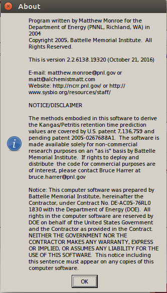
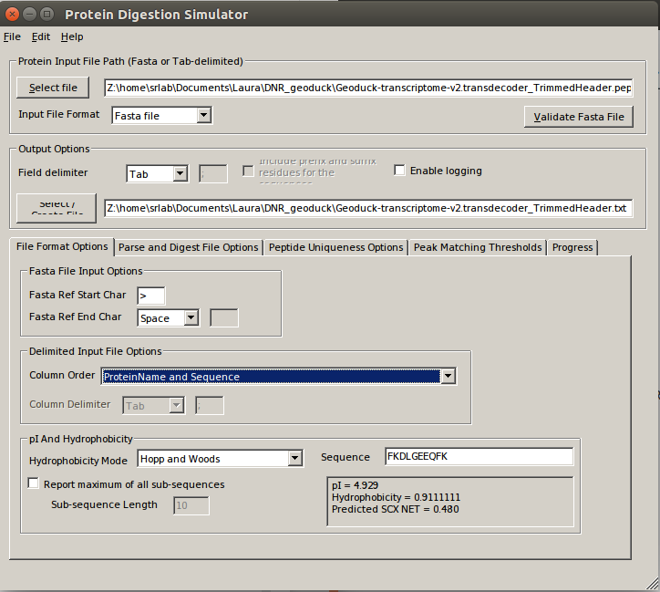
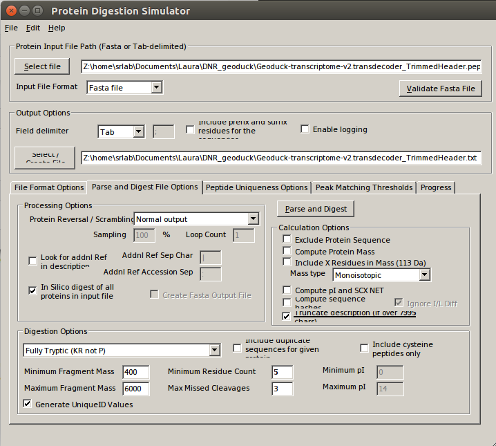
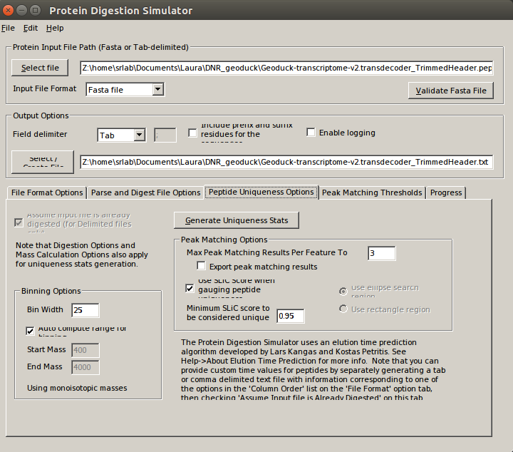
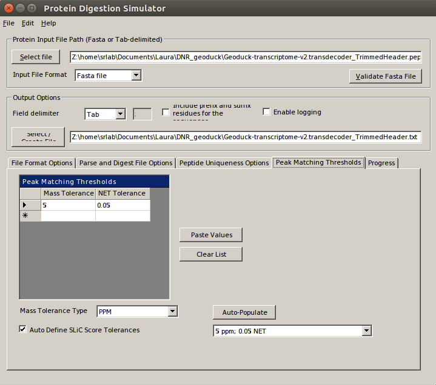
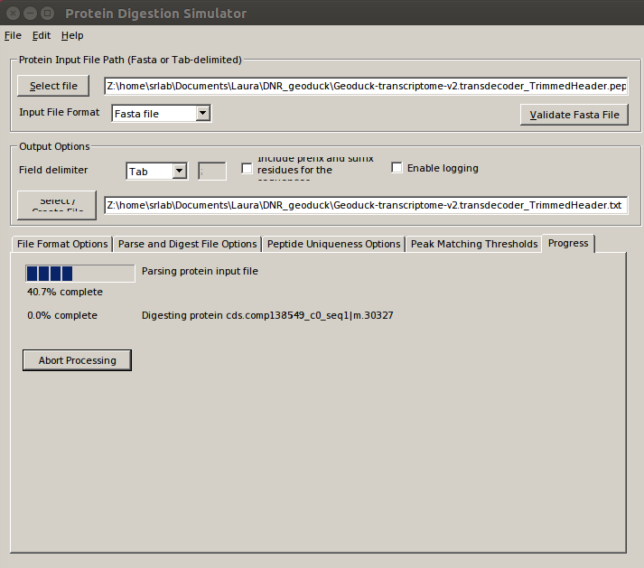
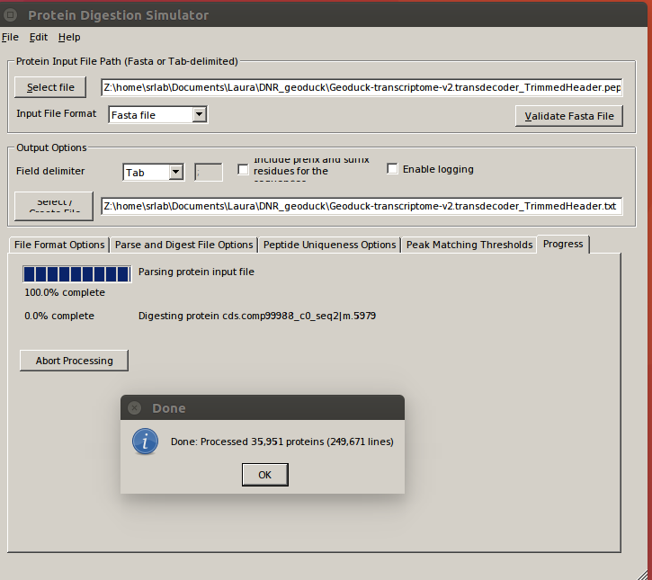

# Digesting background fasta into peptides

### One step before running PECAN is to tryptic digest our geoduck transcriptome fasta protein file _in silico_. We will use the Protein Digestion Simulator program, which breaks up our fasta into fragments, just like we did in our sample prep. The resulting file will constitute the "background database" to identify peptides measured in DIA data. 

### Software Needed: 
   * Command/Terminal window
   * [Protein Digestion Simulator](https://omics.pnl.gov/software/protein-digestion-simulator); verison used: 2.2.6138.19320

### Files Needed:
  * Peptide Retention Time Calibration mixture fasta from Emma, saved in this repo [here](../data/DIA/P00000_Pierce_prtc.fasta)
  * Geoduck Gonad Transcriptome, which you downloaded along with the .raw files in Notebook 00 and saved alongside raw data [here](../data/DIA/2017-Geoduck-DIA-raw/)

### First add the PRTC protein sequences to my background proteome fasta file

Let's take a look at it the [PRTC fasta](../data/DIA/P00000_Pierce_prtc.fasta). 


```python
cat ../../data/DIA/P00000_Pierce_prtc.fasta
```

    
    
    


### Now let's count the number of lines in each the PRTC and the transcriptome fasta files, before joining them: 


```python
# Number of proteins in PRTC; should equal 1
! grep -c "^>" ../../data/DIA/P00000_Pierce_prtc.fasta
```

    1


```python
# Number proteins in transcriptome
! grep -c "^>" ../../data/DIA/2017-Geoduck-DIA-raw/Geoduck-transcriptome-v2.transdecoder.pep
```

    35951


```python
# Combine PRTC & Geoduck transcriptome fasta files:
! cat ../../data/DIA/2017-Geoduck-DIA-raw/Geoduck-transcriptome-v2.transdecoder.pep ../../data/DIA/P00000_Pierce_prtc.fasta > ../../data/DIA/2017-Geoduck-DIA-raw/Geoduck-transcriptome-plus-PRTC.pep
```


```python
# Count number of proteins in combined fasta; should equal 35952
! grep -c "^>" ../../data/DIA/2017-Geoduck-DIA-raw/Geoduck-transcriptome-plus-PRTC.pep
```

    35952


## Now to digest the combined fasta file into peptides via Protein Digestion Simulator

### Open Protein Digestion Simulator

Here is the version I installed & used on Emu


The program is a gui, but requires the use of WINE in Emu, so opening it is a bit convoluted. Here's how:


```python
! cd ~/.wine32
```


```python
ls
```

    Preparing DNR geoduck files for Pecan.ipynb
    Using Protein Digestion Simulator on Emu.ipynb


```python
pwd
```


    u'/home/srlab/Documents/Laura/Jupyter'


```python
cd ~/.wine32
```

    /home/srlab/.wine32


```python
ls
```

    dosdevices/  drive_c/  system.reg  userdef.reg  user.reg  winetricks.log


```python
cd drive_c/
```

    /home/srlab/.wine32/drive_c


```python
ls
```

    msfmsi.log  Program Files/  users/  windows/


```python
cd Program\ Files
```

    /home/srlab/.wine32/drive_c/Program Files


```python
ls
```

    Common Files/       ProteinDigestionSimulator/  Windows NT/
    Internet Explorer/  Thermo/
    Microsoft.NET/      Windows Media Player/


```python
cd ProteinDigestionSimulator/
```

    /home/srlab/.wine32/drive_c/Program Files/ProteinDigestionSimulator


```python
! WINEPREFIX=~/.wine32 wine ProteinDigestionSimulator > runningPDS.txt
```

### Used the following setting to digest our combined fasta file, Geoduck-transcriptome-plus-PRTC.pep

### Tab 1:


### Tab 2:


### Tab 3:


### Tab 4:


### Progress (took ~30 minutes)


### Complete!



```python

```
