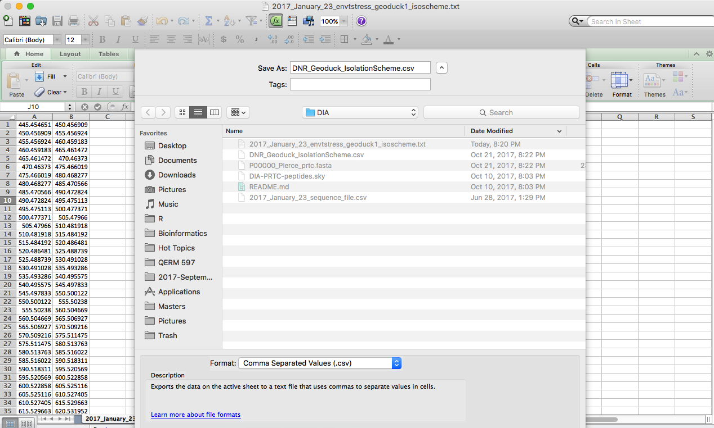

 
## Preparing files for PECAN

1. Digest background proteome fasta into peptide fragments using Protein Digestion Simulator  
  2. Convert Isolation scheme (from Emma from Lumos) to .csv file 
  3. Create .txt file with list of paths to all mzML files  

Note: you also need a .txt file listing the name of the background proteome database. This has already been created, and is located in [DNR_Geoduck_DatabasePath.txt](../../analyses/DIA/DNR_Geoduck_DatabasePath.txt)

---

## Step 3. Digest background fasta into peptides

Before running PECAN is to tryptic digest our geoduck transcriptome + PRTC fasta file (generated in Step 2) _in silico_. We will use the Protein Digestion Simulator program, which breaks up our fasta into fragments, just like we did in our sample prep. The resulting file will constitute the "background database" to identify peptides measured in DIA data. 

* **Input file:** Combined geoduck transcriptome + PRTC fasta file: [GeoTranscriptomePRTC.fasta](http://owl.fish.washington.edu/generosa/Generosa_DNR/GeoTranscriptomePRTC.fasta)
* **Output File:** Combined geoduck transcriptome + PRTC fasta file, tryptic digested into peptides [GeoTranscriptomePRTC_digested_Mass400to6000.txt](http://owl.fish.washington.edu/generosa/Generosa_DNR/GeoTranscriptomePRTC_digested_Mass400to6000.txt)

### Software Needed: 
 * Command/Terminal window in Windows
 * [Protein Digestion Simulator](https://omics.pnl.gov/software/protein-digestion-simulator); verison used, installed on Woodpecker: 2.2.6471.25262 

#### The following are screen shots showing settings used in PDS; note I selected the transcriptome with trimmed header for our input file, which we generated in Step 1 of this notebook. 

#### Tab 1:

#### Tab 2:

#### Tab 3:

#### Tab 4:

#### Go back to Tab 2 to execute the digestion: 

#### The digestion took ~30 minutes; you can watch the % complete on the Progress tab: 

#### When complete a box will pop up describing how many proteins were processed. We know we should have 35952 proteins (from step 2 of this notebook):

---
## Step 4. Convert isolation scheme text file to .csv

Emma sent us the isolation scheme file, extracted from Lumos. To use this in PECAN we need it in .csv format

* **Input File:** [2017_January_23_envtstress_geoduck1_isoscheme.txt](../data/DIA/2017_January_23_envtstress_geoduck1_isoscheme.txt). 
* **Output File:** [DNR_Geoduck_IsolationScheme.csv](../data/DIA/DNR_Geoduck_IsolationScheme.csv)

To convert, I simply opened the .txt file in Excel, then saved as .csv and re-named:

---
## Step 5. Create a .txt file with list of paths to all mzML files

PECAN needs a list of the DIA data files (in .mzML format) in order to execute the run, so we need to create a .txt file that lists all .mzml file names. 

* **Input File:** R-script to extract .mzML file names and create a .txt file: [05-Script-File-path-for-PECAN.R](../scripts-notebooks/05-Script-File-path-for-PECAN.R)
* **Output File:** Text file: [DNR_Geoduck_mzMLpath.txt](../data/DIA/2017-Geoduck-DIA-raw/DNR_Geoduck_mzMLpath.txt)   

---

### You are now ready to move to Notebook 04, [Building a Spectral Library with PECAN](../scripts-notebooks/DIA/06-Notebook-Building-Spectral-Library-with-PECAN.md)
