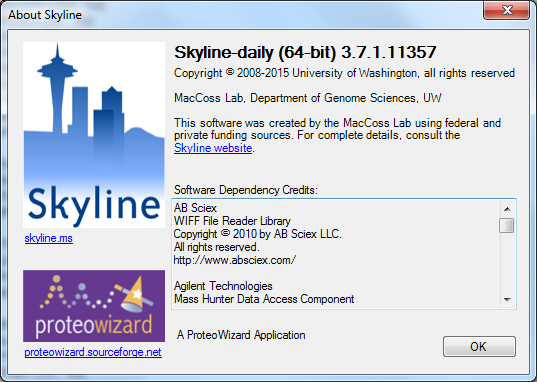

# Create a Skyline project file & upload .raw files

This notebook outlines how to create a new Skyline project file & upload .raw files to analyze SRM data in Skyline. 

## Software:
  * Text reader, e.g. [TextWrangler](https://itunes.apple.com/us/app/textwrangler/id404010395?mt=12), [NotePad++](https://notepad-plus-plus.org/)  
  * Microsoft Excel (or other .xml software)  
  * [Skyline Daily](https://skyline.ms/project/home/software/Skyline/daily/register-form/begin.view?); registration required.
  IMPORTANT NOTE: Use **Skyline Daily**, as opposed to Skyline.  The Daily version automatically updates when the developers push changes.  If you try to open a project in Sklyine that was created in the Daily version it likely won't work.  

## Files:
  * Fasta file with SRM target proteins: [2017-geoduck-SRM-targets.fasta](../data/SRM/2017-geoduck-SRM-targets.fasta)
  * .blib from DIA, aka background proteome: [2017-05-23_geoduck_desearleinated.blib](http://owl.fish.washington.edu/generosa/Generosa_DNR/Skyline_June2017/)
  * Fully created Skyline project .zip file for this SRM data is in Owl: [2017-geoduck-SRM](http://owl.fish.washington.edu/generosa/Generosa_DNR/2017-July-SRM-various-files/2017-geoduck-SRM.sky.zip)

## Step 1: Open new Skyline Daily file, save and name. 

## Step 2: Adjust Peptide Settings
Select **_Settings -> Peptide Settings_** and adjust each tab settings as follows:  

**DIGESTION:** this tab will import your background proteome using the fasta file with your SRM targeted protein sequences  
   * Emzyme: "Trypsin [KR|P]"  
   * Max missed cleavages: 0   
   * Background proteome: you'll likely need to create a new background proteome (unless it's already saved on your computer):  
     * Select **_Add_**  
     * Type a short-hand name for your proteome (e.g. "2017 Geoduck SRM Targets")  
     * Select **_Create_**;  
     * Type a file name for your proteome (e.g. 2017-geoduck-SRM-targets), select **_Save_**  
     * Add .fasta file via **_Add_**, select the .fasta file with your SRM target proteins (e.g. "[2017-geoduck-SRM-targets.fasta](../data/SRM/2017-geoduck-SRM-targets.fasta)"), **_Open_**  
   * Enforce peptide uniqueness by: "None"  

     
---

**PREDICTION:** 
  * Retention time predictor: None  
  * Use measured retention times with present: NOT checked  
  * Drift time predictor: None  
  * Use spectral library drift times when present: NOT checked  

--- 

**FILTER:** 
  * Min length: 2  
  * Max length: 25  
  * Exclude N-terminal AAs: 0  
  * Exclude potential ragged ends: NOT checked  
  * Exclude peptides containing: all NOT checked  
  * Auto-select all matching peptides: checked  

---

**LIBRARY:** this tab will import your spectral library, aka .blib file from DIA analysis.   
  * Libraries: You'll likely need to add the .blib unless it's already on your computer.  
    * Select **_Edit list... -> Add.. -> Browse_**   
    * Select the .blib file from your DIA analysis (e.g. "[2017-05-23_geoduck_desearleinated.blib](http://owl.fish.washington.edu/generosa/Generosa_DNR/Skyline_June2017/)") & **_Open_**  
    * Name your spectral library (e.g. "Geoduck-gonad-DNR-library"), select **_Okay_** and make sure your newly added library is checked.  
  * Pick peptides matching: Library  
  * Rank peptides by: (nothing selected)  

---

**MODIFICATIONS:** 
  * Structural modifications: "Carbamidomethyl (C)" checked  
  * Max variable mods: 3  
  * Max neutral losses: 1  
  * Isotope label type: heavy  
  * Isotope modifications: NOT checked  
  * Internal standard type: light  

---

**QUANTIFICATION:** 
  * Regression fit: Linear through zero  
  * Normalization Method: None   
  * Regression Weighting: None  
  * MS Level: All  
  * Units: (blank)  

## Step 3: Populate analyte tree, aka add your SRM target proteins to "Targets" pane
Open your SRM targeted protein fasta in a text reader, highlight all contents and copy

Your Targets pane should now list all proteins, which you can unfold to reveal peptides and transitions:

## Step 4: Adjust Transition Settings

**PREDICTION:**
  * Precursor mass: Monoisotopic  
  * Product ion mass: Monoisotopic  
  * Collision energy: Thermo TSQ Vantage  
  * Declustering potential: None  
  * Optimization library: None  
  * Compensation voltage: None  
  * Use optimization values when present: NOT checked  

---

**FILTER:**
  * Precursor charges: 2, 3  
  * Ion charges: 1, 2  
  * Ion types: y  
  * Product ion selection  
    * From: ion 2  
    * To: last ion  
  * Special ions: all NOT checked  
  * Precursor m/z exclusion window: (blank)  
  * Auto-select all matching transitions: checked  

---

**LIBRARY:**
  * Ion match tolerance: 0.5 m/z  
  * If a library spectrum is available, pick its most intense ions: NOT checked  

---

**INSTRUMENT:**
  * Min m/z: 100  
  * Max m/z: 2000  
  * Dynamic min product m/z: NOT checked  
  * Method match tolerance m/z: 0.055 m/z  
  * Fimware transition limit: (blank)  
  * Firmware inclusion limit: (blank)  
  * Min time: (blank)  
  * Max time: (blank)  

---

**FULL-SCAN:**
  * Isotope peaks included: Count  
  * Precursor mass analyzer: Orbitrap  
  * Peaks: 3  
  * Resolving power: 60,000  
  * At: 400 m/z  
  * Isotope labeling enrichment: Default  
  * Acquisition method: Targeted  
  * Product mass analyzer: Centroided  
  * Isolation scheme: (blank)  
  * Mass Accuracy: 20 ppm  
  * Use high-sensitivity extraction: NOT checked  
  * Select "Use only scans within **2** minutes of MS/MS IDs"   

## Step 5: Import .raw files into Skyline.  

In [Notebook 00]() you downloaded all .raw files associated with geoduck samples, and saved locally. To import into Skyline go to **_File -> Import -> Results_**

#### A box will pop up; I used the default settings:

#### Another box will pop up where you navigate to the folder containing your .raw files. Highlight all .raw files and click _**Open**_:

#### Another box will pop up giving you the option to remove extraneous info for each replicate, which I recommend: 

#### As the SRM data is importing you'll see chromatograms popping up. 

## Step 6: Re-arrange Skyline window

#### Once all files are imported, you can re-arrange your view. 
* Click on the + or - sign next to your proteins to unfold/refold all peptides in that protein; similarly you can click on the + next to a peptide to unfold all transitions within that peptide.
 * Select _View -> Retention Time -> Replicate Comparison_ to see how the retention times compare between samples
 * Select _View -> Peak Areas -> Replicate Comparison_ to see how the abundance compares between samples
 * Drag the RT & Peak Areas panes and "snap" into place somewhere in the Skyline screen - I like them on the right
 * Click on a peptide, then select _View -> Auto-zoom -> Best Peak_ to zoom into the peak that Skyline has selected for the replicate/peptide you're currently looking at (or use F11 as a keyboard shortcut). You'll use this auto-zoom quite a bit when you pick peaks in notebook 3. 

Check out my quick screen capture to see me doing these steps in action:

#### Your Skyline window should look something like this, and you're now ready to QC the data: 

